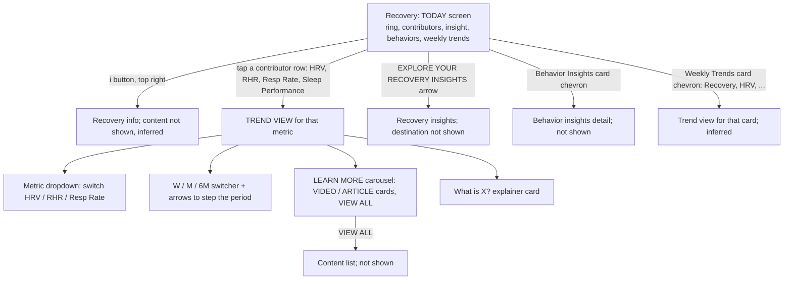

# WHOOP vs Pulse: Recovery area gap analysis

## Summary

WHOOP's Recovery screen ("TODAY") is a single scroll: a yellow/green/red ring, a four-row contributor card that compares today's value with the 30-day value and shows an arrow, an insight card, a Behavior Insights card with chips, then a "Weekly Trends" stack of small charts (Recovery bars, HRV line, and so on). Tapping a contributor opens a "TREND VIEW" with a metric dropdown, W / M / 6M switcher, period stepper, typical-range band, a Learn More carousel and a "What is X?" explainer. Pulse has the ring, an insight card, a contributor card, and per-metric detail screens with W/M/6M/1Y and a normal-range band, but it is built around a different model: a baseline-and-points scale per contributor, a "What shaped it" driver list, a forecast, and no editorial content or behaviour chips on the Recovery screen. Gaps below are what a cloner would need to change.

Gap count by severity (31 total): missing-screen 4, missing-element 9, behaviour 8, visual 10.

Screenshots are real phone captures and show one state each. Where a WHOOP behaviour is not visible in a screenshot (for example what the Weekly Trends cards do when tapped beyond the chevron) it is marked as inferred. Pulse screenshots are demo mode, 390 px wide.

## WHOOP navigation (as seen in the screenshots)

Screens seen: 01, 05, 11, 12 (Today); 02, 03, 04 (HRV trend, scrolled in three positions); 06, 07 (RHR); 08, 09, 10 (Resp Rate). 13 to 15 are scroll positions of Weekly Trends.

## Gaps

Severity: missing-screen, missing-element, behaviour, visual. File names below are in `docs/research/whoop-walkthrough/`.

| # | Gap | Severity | WHOOP ref | Pulse ref | Notes |
|---|---|---|---|---|---|
| 1 | No Behavior Insights card on Recovery. WHOOP shows a card titled BEHAVIOR INSIGHTS (lightbulb icon, chevron) with "Some of your behaviors from yesterday may have affected your Recovery score today." and chips: green up-triangle "86%+ Sleep Performance", orange down-triangle "Early Workout", neutral dot "7+ Strain", neutral dot "Consistent Wake Time". | missing-element | recovery-11, 12, 14, 15 | none (`src/app/(app)/recovery/page.tsx` has no such section) | Pulse has behaviour impact data in Journal Insights (`src/app/(app)/journal/insights/Impacts.tsx`, `src/core/algorithms/journalImpact.ts`), so the data source partly exists, but chips are tied to journal check-ins, not automatic conditions like "86%+ Sleep Performance". Chip colours: green fill = positive, orange fill = negative, grey = neutral/no effect. |
| 2 | Behavior Insights card is tappable (chevron). Destination not visible. | missing-screen | recovery-11, 12 | none | Inferred: opens a behaviour detail screen. Pulse's nearest is `/journal/insights`. |
| 3 | No "Weekly Trends" stack of mini charts on Recovery. WHOOP has a "Weekly Trends" heading and one card per metric: RECOVERY (7 bars), HEART RATE VARIABILITY (7-point line), and more below (not captured). Each card has a title in caps and a right chevron. | missing-element | recovery-12, 13, 14, 15 | `src/app/(app)/recovery/page.tsx:52` (one "Recovery trend" card only) | Pulse has one TrendChart with the W/M/6M toggle (`src/components/charts/TrendChart.tsx:231`). WHOOP's section is fixed at the last 7 days with no switcher on the card. Cards for RHR, Resp Rate and Sleep Performance are not captured, so their order is unknown. |
| 4 | Weekly Trends cards are tappable via a chevron to open that metric's trend view. | behaviour | recovery-12 to 15 | none | Inferred from the chevrons, since no tap was captured. Pulse's trend chart is not a link. |
| 5 | Weekly Recovery bars: bars are bright pure green (`#19ec06` family, 77%, 79%, 72%) and bright yellow (56, 61, 63, 55) with the percentage printed above each bar in the same colour; today's column (Wed 15) has a lighter highlighted background and bold day label; x labels are weekday over day number (Thu / 9). Gridlines are 4 faint horizontals. | visual | recovery-12, 13, 14, 15 | `src/components/charts/TrendChart.tsx:366` (CapBar, label via LabelList at :367) | Pulse already draws band-coloured bars with value labels in W range and a bold selected day (`:370` tick). Gaps are the coloured value text, the full-height highlight behind today and the weekday-plus-day-number two-line tick (Pulse uses a narrow weekday letter via `tickFormat`, `TrendChart.tsx:180`). Pulse's Recovery trend (M range) does draw gradient band-coloured bars with green/yellow/red y labels 100 / 67 / 33 and an Avg pill (`recovery-02`); WHOOP's M view of Recovery was not captured. Check spec before changing, since colours come from the spec's band tokens. |
| 6 | Weekly HRV card: line with hollow ring markers at every day, values printed above each point in blue (48, 48, 44, 45, 46, 46, 43), soft area fill under the line, highlighted today column. | visual | recovery-13, 14, 15 | `src/components/charts/TrendChart.tsx:325-346` | Pulse has area fade and an active glow dot only on the selected point; no persistent ring marker per point and the labels use `foreground-secondary` (`:346`). Pulse labels the line only in W range, so W matches in principle. Colour is blue in WHOOP, `--chart-5`/single in Pulse. |
| 7 | Contributor rows show today's value large with a small previous/30-day value underneath (43 over 46) and a small coloured triangle to the right (orange down for HRV, green down for RHR, orange up for Resp Rate, green up for Sleep Performance). | missing-element | recovery-01, 05, 11 | `src/components/metrics/ContributorRow.tsx:62-110` | Pulse shows value + unit + signed points ("-28 pts") and a baseline sentence instead. There is a Spec delta-arrow convention (`docs/design/spec.md` around line 795) used elsewhere, but ContributorRow does not use it. The "30-day value" under the number is absent. |
| 8 | Contributor rows have no baseline slider/track. WHOOP rows are flat: icon, caps label, value, small value, triangle. | visual | recovery-01, 05 | `src/components/metrics/ContributorRow.tsx:94-100` (track, band, marker), `:103` ("Baseline 54 +/- 8 ms") | Pulse deliberately uses a track with normal-range band and a "Dot: today. Shaded: your normal range." legend (`recovery/page.tsx:47`). Treat as an intentional Pulse difference unless the team wants a pure clone. |
| 9 | Legend strip under the contributors: "up-green down-orange triangles  Today vs. last 30 days" in a dark inset pill. | missing-element | recovery-01, 05, 11 | `src/app/(app)/recovery/page.tsx:47` (different copy: "Dot: today. Shaded: your normal range.") | Copy and the two-colour triangle swatch both differ. |
| 10 | Contributor set differs: WHOOP has four rows in the order HRV, RHR, Respiratory Rate, Sleep Performance. Pulse has five, adding Skin Temperature. | behaviour | recovery-01 | `src/app/(app)/recovery/page.tsx:24-25, 43` | Skin temperature is in Pulse's score by design (`docs/research/recovery-readiness.md` composite weights: skin 0.05). Order already matches for the first four. Decide whether to hide the fifth row on the clone. |
| 11 | Contributor values use no unit text next to the number (43, 59, 16.1, 92%), only Sleep Performance gets "%". Pulse prints "42 ms", "58 bpm", "14.7 rpm" in a smaller suffix. | visual | recovery-01 | `src/components/metrics/ContributorRow.tsx:82` | Minor. Trend view in WHOOP does show units ("46 ms", "59 bpm", "15.8 rpm"). |
| 12 | Insight card copy and link: "Your RHR (59 bpm) is within its typical range of 58 bpm to 62 bpm, which contributed to a yellow Recovery. Today is a great day to stay active and achieve your health goals." plus link "EXPLORE YOUR RECOVERY INSIGHTS" with arrow in purple/blue gradient hairline card. | visual | recovery-05, 11 | `src/app/(app)/recovery/page.tsx:50` ("See what shaped it", anchor `#drivers`) | Card style matches (hairline gradient, `docs/design/spec.md` line 166 and 775). Link text and destination differ: WHOOP's goes to a separate insights screen; Pulse scrolls to an in-page anchor. The WHOOP insight picks one contributor and names a band colour word; Pulse's names the weakest ("Your HRV is below your baseline..."). |
| 13 | "EXPLORE YOUR RECOVERY INSIGHTS" destination is a separate screen. Content not captured. | missing-screen | recovery-05, 11, 12 | none | Do not guess. Capture it before cloning. |
| 14 | No "What shaped it" or "Tomorrow's forecast" on WHOOP's Recovery screen. | behaviour | recovery-01 to 15 | `src/app/(app)/recovery/page.tsx:57-65` | Extra Pulse sections; not in any WHOOP capture. Mark as Pulse-only. Remove or keep per product decision. |
| 15 | Ring hero: WHOOP's wordmark "WHOOP" above the value, "55%" with small "%", label "RECOVERY"; ring only colours, no band word. Ring track is dark grey, fill starts at top and has a rounded end. | visual | recovery-01 | `src/app/(app)/recovery/page.tsx:39` | Pulse draws the same layout with "PULSE" wordmark and adds the band word "RED" under the label. Spec says this is deliberate for accessibility (`docs/design/spec.md` line 867). Intentional per spec. |
| 16 | Header: "TODAY" title with back arrow and a circled "i" at right. No date stepper arrows on the screen. | behaviour | recovery-01, 05 | `src/app/(app)/recovery/page.tsx:37` (`dateSwitcher` day mode in header) | Pulse shows "< TODAY >" with arrows. Spec calls for the date pill (`docs/design/spec.md` line 45). Intentional unless WHOOP behaviour is wanted. |
| 17 | Trend View header: screen title "TREND VIEW" with a full-width dropdown "HEART RATE VARIABILITY" with icon and chevron, letting the user switch to RHR / Respiratory Rate etc. without going back. | missing-element | recovery-04, 07, 09, 10 | `src/app/(app)/metric/[key]/page.tsx:56` (title is the metric name; no switcher) | Pulse's header title is the metric name ("HEART RATE VARIABILITY"). It has a date switcher but no metric dropdown. The dropdown's option list is not captured. |
| 18 | Trend View: "AVERAGE" label, big value with unit ("46 ms"), and a delta pill ("2% vs. prior month"; RHR "3% vs. prior week" green; Resp "0% vs. prior week" grey; "1% vs. prior 6 months" green). The delta is a percentage. | behaviour | recovery-04, 07, 09, 10 | `src/components/charts/TrendChart.tsx:62` (`RANGE_PRIOR`), `:247` (chip) | Pulse has the same chip placement but expresses the delta as an absolute value ("2 ms vs. prior month", `metric-hrv-01`), not a percentage. Colour logic is also different: WHOOP HRV below prior month is orange, RHR down is green, Resp 0% is grey neutral. Pulse follows `deltaTone` (spec line 795), so the tones should already agree. |
| 19 | Trend View: W / M / 6M segmented control sits to the right of the average, and the active segment is a lighter pill. Pulse adds a fourth segment "1Y". | behaviour | recovery-04, 07, 10 | `src/components/charts/TrendChart.tsx:231`, `src/lib/url.ts:51` | WHOOP shows three; Pulse's four-way switcher is full width below the history header (`metric-hrv-01`). Layout differs: in WHOOP the switcher is beside the average. |
| 20 | Period stepper: a row "<  MAR 17 - APR 15, 26  >" (right arrow greyed when at the latest period; 6M: "OCT 18, 25 - APR 15, 26"). Previous/next arrows move the window back one week/month/6 months. | missing-element | recovery-04, 07, 09, 10 | none (`TrendChart` always shows the trailing window ending today; only the page-level day switcher moves it) | Highest-impact interaction gap on the trend screens. |
| 21 | One-sentence verdict under the stepper that changes per range and metric: HRV M "Your average HRV this month (46) was below your previous 30-day average of 47."; RHR W "Your average RHR during this 7-day period was within its typical range (58 - 62) at the time."; Resp W "Your respiratory rate is consistently within or near your typical range. This is a positive indication of normal bodily function."; Resp 6M "Your average respiratory rate over this period (15.8) was below your previous 6-month average of 16.0." | missing-element | recovery-04, 07, 09, 10 | none | Pulse has no generated sentence on the chart. Copy variants are visible in the screenshots (below-average, within-range, near-range); other branches (above, no data) are not and should be defined. |
| 22 | Typical range band on the chart: a lighter grey horizontal band, with a legend swatch "TYPICAL RANGE" at the top right of the chart. | visual | recovery-04, 07, 09 | `src/components/charts/TrendChart.tsx:301` (band), `:376` (caption below chart: "Shaded: your normal range") | Same idea, different name and legend placement. The band itself exists. Pulse's HRV tile shows the band clearly; on Resp and RHR it is a thin strip hidden behind the bars (`metric-resp-01`, `metric-rhr-01`). |
| 23 | Chart rendering in W range: hollow circle markers on every day, blue value labels on every point (57, 61, 60, 57, 57, 61, 59; Resp 14.9 to 16.1), weekday plus date on the x axis (Thu 9). Last point has a ring. | visual | recovery-07, 09 | `src/components/charts/TrendChart.tsx:325-346` | See gap 6. Pulse W line has labels but a smaller marker and plain narrow weekday letters. |
| 24 | Chart type in M range: WHOOP draws a continuous blue line with no per-point markers except a ringed latest point carrying a boxed value tag ("43"), left y-axis (71 / 58 / 45 / 32) and weekly x ticks (Mar 18, Mar 25, Apr 1...). Pulse draws one blue bar per day for HRV, RHR and Resp (`metric-hrv-01`, `metric-rhr-01`, `metric-resp-01`), with y labels on the left, an "Avg" pill at the right, no ringed latest point and no value tag. | visual | recovery-03, 04 | `src/components/charts/TrendChart.tsx:366` (bars) vs `:325-343` (line), `docs/design/spec.md` line 1004 (W and M are bars by spec) | The bar choice for M is specified in Pulse's spec, so switching vital metrics to a line in W/M is a deliberate change. Resp bars in Pulse span 0 to 16 so day-to-day movement is invisible; WHOOP's axis (11.5 to 21.5) is tight around the data. The "Avg" pill has no WHOOP counterpart. |
| 25 | 6M chart is a monthly summary: faint daily line in the background, plus one horizontal bar per month with the month's average above it (16.0, 15.8, 15.9, 15.8, 15.8, 15.7) and a coloured percent change vs previous month under it (-1% green, +1% orange, none for flat). Bars are white (flat), green (better), orange (worse). X labels are month names (Nov to Apr). | behaviour | recovery-10 | none (`TrendChart.tsx` 6M draws daily points; `docs/design/spec.md` line 1004 specifies a grey line with band dots for 6M) | A new chart mode, not just a restyle. Colour semantics for Resp: orange when up, green when down (so lower = good here), which differs from Pulse's rule that Resp is always neutral tone (spec line 795). WHOOP's own Resp contributor arrow in recovery-01 is orange up, which is consistent with "up = orange". Resolve the contradiction with the spec before building. |
| 26 | Learn More carousel: heading "LEARN MORE" and a "VIEW ALL ->" link; horizontally scrolling cards 200 px wide with a VIDEO or ARTICLE tag at the top right; video cards show a presenter still, a play button and a title ("What is HRV?", "Improving HRV Tips", "What is RHR?"); article cards show an illustrated or photo tile and a 2 to 3 line title ("RHR: What's Normal and How to Improve It", "Understanding Respiratory Rate: What it Is, What's N...", "What Does an Infection Do to Your Respiratory Rate?"). | missing-element | recovery-02, 03, 04, 06, 07, 08 | none | Pulse is self-hosted and has no editorial or video content. Likely needs an explicit product decision; a text-only version with article cards linking to external or in-app explainers is the minimum. Mark videos as not clonable without content. |
| 27 | "VIEW ALL" content list screen. | missing-screen | recovery-02, 06, 08 | none | Destination not captured. |
| 28 | "What is X?" explainer card is a rounded card at the bottom with a bold title ("What is Heart Rate Variability?", "What is Resting Heart Rate?", "What is Respiratory Rate?") and 2 to 3 paragraphs. Pulse's equivalent is titled "About heart rate variability" and is a short one- or two-sentence blurb. | visual | recovery-02, 06, 08 | `src/app/(app)/metric/[key]/page.tsx:99-104`, `src/server/queries/metric.ts:58-60` | Copy gap: WHOOP texts are 2 to 3 paragraphs covering what, why it differs per person, and how to read changes. Title format differs ("What is ...?" vs "About ..."). Verbatim WHOOP copy should not be copied; write Pulse's own in the same structure. |
| 29 | No hero value for the day on the WHOOP trend screen, so there is no "today's value + chip comparing it with the 30-day average" block. | behaviour | recovery-04, 07, 09 | `src/app/(app)/metric/[key]/page.tsx:113-150` (Hero) | Pulse adds a large "42 ms" hero with "13 ms below your 30-day average", date switcher, a "Last 30 days" stats card (daily average, highest, lowest, days with data) and "Unusual days" (`sections.tsx:142`). None of those appear in WHOOP's trend view screenshots (the lower part of the page is not captured, so these could exist below the explainer; the screenshots end at the explainer card). Pulse-only extras: keep or drop. |
| 30 | Sleep Performance contributor taps to a Trend View with the same layout (inferred; not captured). | missing-screen | recovery-01 | `src/app/(app)/recovery/page.tsx:44` (links to `/sleep`) | Only HRV, RHR and Resp Rate trend views were captured. Pulse sends Sleep Performance to the Sleep screen instead of a trend screen. |
| 31 | Floating coach button at lower right (round "W" glyph) over every screen. | missing-element | recovery-01 to 15 | Pulse has an equivalent round action button (`docs/design/spec.md` line 776) | Covered in the Pulse shell, not specific to Recovery. Listed so nobody redoes it. |

## Status, score-screens phase (2026-10-08)

Build steps for the score-screens phase: 1 trend helpers (`src/lib/trend.ts`), 2 Trend View query, 3 Trend View screen `/trend/[key]`, 4 `WeeklyTrends`, 5 Sleep, 6 Recovery, 7 Strain. "Hidden" means the component is built but off in `src/lib/features.ts` until Pulse has a data source. "Out of scope" means the owner excluded it for this phase. Decisions are recorded in `docs/design/spec.md` §11 from R29 onwards.

| # | Plan | Status |
|---|---|---|
| 1 | Step 6: Behavior Insights card with automatic chips (sleep performance, strain, wake time, workout timing) | Done (R34) |
| 2 | Step 6: the card links to Journal insights (WHOOP's destination was not captured) | Done (R34) |
| 3 | Steps 4 and 6: Weekly Trends (Recovery, HRV, RHR, Respiratory rate, Sleep performance) | Done (R32) |
| 4 | Step 4: cards link to their Trend View | Done (R32) |
| 5 | Step 4: band-coloured value labels, today's column highlight, two-line labels | Done (R32) |
| 6 | Step 4: HRV line with ring markers and value labels | Done (R32) |
| 7 | Step 6: flat contributor rows showing today's value over the 30-day value, with a triangle | Done (R34) |
| 8 | Step 6: the baseline track is dropped | Done (R34) |
| 9 | Step 6: "Today vs. last 30 days" legend | Done (R34) |
| 10 | Step 6: the skin temperature row is hidden; it still counts in the score | Done (R34) |
| 11 | Step 6: no unit text after contributor values | Done (R34) |
| 12 | Step 6: insight link "Explore your recovery insights" to the Recovery Trend View | Done (R34) |
| 13 | Same link as gap 12 (WHOOP's screen was not captured) | Done (R34) |
| 14 | Step 6: "What shaped it" and "Tomorrow's forecast" are removed from Recovery | Done (R34) |
| 15 | Step 6: no band word under the ring | Done (R34) |
| 16 | Steps 5-7: the Recovery, Sleep and Strain headers read "TODAY" with no date arrows | Done (R33): the date alone on Recovery, Sleep and Strain |
| 17 | Step 3: metric dropdown | Done (R29) |
| 18 | Steps 1 and 3: relative % chip; Resp up is orange | Done (R30, R34) |
| 19 | Step 3: W/M/6M beside the average, no 1Y | Done (R30) |
| 20 | Step 3: period stepper | Done (R29) |
| 21 | Steps 1 and 3: verdict sentence, including the typical-range wording | Done (R29) |
| 22 | Step 3: "Typical range" band with its legend at the top right | Done (R30) |
| 23 | Step 3: W ring markers, value labels, two-line day ticks | Done (R30) |
| 24 | Step 3: M line with a ringed latest point, a value tag and a tight axis | Done (R30) |
| 25 | Steps 1 and 3: 6M month segments with coloured % change | Done (R30) |
| 26 | Learn More carousel | Out of scope |
| 27 | View all list | Out of scope |
| 28 | Step 3: "What is X?" explainer in Pulse's own words | Done (R29) |
| 29 | Step 3: the Trend View has no day hero; `/metric/[key]` keeps it | Done (R29) |
| 30 | Step 6: the Sleep performance row opens its Trend View | Done (R34) |
| 31 | Already covered by the shell's coach button | No change |

## Already matches

- Ring dial layout: large percentage with a small "%", "RECOVERY" label, wordmark above, band-colour arc, dark track, wordmark replaced by "PULSE" (`recovery/page.tsx:39`, `ScoreDial`).
- Contributor card as a raised panel under the ring with a small notch pointing up at the ring, caps labels, line icons (heart-rate wave, heart, lungs/wind, moon), row separators.
- Contributor order for the first four rows: HRV, RHR, Respiratory Rate, Sleep Performance.
- Insight card with a gradient hairline and a blue caps link with an arrow (`InsightCard`; spec line 166).
- Back arrow and circled "i" in the header; the ring detail is reached from Home.
- Trend metric header pattern: "AVERAGE", large value and unit, delta chip "vs. prior month/week", W / M / 6M segmented control with the active segment lighter (`TrendChart.tsx:226-250`).
- Normal-range band drawn behind the line (`TrendChart.tsx:301`); selected day bold on W (`:370` ticks).
- Band-coloured recovery bars with value labels in W (`TrendChart.tsx:366-367`).
- Delta tone rules for the arrows (`src/lib/bands.ts`, spec line 795).

## Intentional differences (do not report as bugs)

- Band word under the ring label ("RED"): kept for accessibility, `docs/design/spec.md` line 867.
- Date stepper arrows in the Recovery header: spec C3 / `DetailShell`.
- Baseline track with "Baseline 54 +/- 8" per contributor and the points column: Pulse's own score model (`docs/research/recovery-readiness.md`).
- Skin temperature as a fifth contributor: part of the Pulse score.
- "What shaped it" and "Tomorrow's forecast": Pulse-only sections.
- Coach pill not adopted as a floating pill: spec line 776.
- `docs/research/metric-detail-patterns.md` records the trend screen's history card, 1Y range and stats card as Pulse's own design after surveying several apps, so gaps 19 (1Y) and 29 are choices, not omissions, unless the team wants a pure WHOOP clone.
