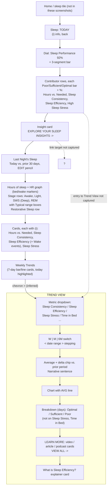

# WHOOP vs Pulse: Sleep gap analysis

## 1. Summary

Pulse's Sleep screen (`/sleep`) already copies most of WHOOP's *Today* sleep page: the dial with its three-segment status bar, the contributor rows with Poor / Sufficient / Optimal bars and legend, the gradient insight card, "Last night's sleep" with the HR line and stage rows, "Hours vs. needed" with the Healthy minimum / Recent strain / Sleep debt legend, and the Sleep consistency bed/wake chart. What is missing is everything WHOOP builds around those cards: the **Sleep Stress** contributor, card and trend; the **Weekly Trends** section; the dedicated **Trend View** screen (period stepping, narrative sentence, days-breakdown bar, Learn More cards, "What is X?" explainer); and a few card details (Asleep/Awake wake-event bar, Restorative row under the stages, the insight link). Pulse's `/trends` is a generic picker with W/M/6M/1Y and an Averages card, so it covers only a slice of what WHOOP's Trend View does.

Gap count by severity (21 gaps): **missing-screen 3, missing-element 11, behaviour 2, visual 5.** Two items are listed separately as intentional differences.

Sources: WHOOP `docs/research/whoop-walkthrough/sleep-01..35-*.png`; Pulse demo tiles (390 px) and code under `src/app/(app)/sleep`, `trends`, `metric/[key]`; `docs/design/spec.md` (sleep section around line 1774), `docs/research/sleep.md`, `docs/research/metric-detail-patterns.md`, `docs/design/charts.md`.

## 2. WHOOP navigation for this area (from the screenshots)

Taps that open the Trend View are not captured in the screenshots. The Weekly Trends cards show a ">" chevron, so those are the likely entry; that is an inference. Everything else below is visible.

Weekly Trends cards seen, in order: Sleep Performance, Hours vs. Needed (hours, two-line chart), Hours vs. Needed (%), Restorative Sleep (hours, stacked), Sleep Consistency, Time in Bed, Sleep Efficiency (sleep-28..34).

## 3. Gaps

Severity key: missing-screen, missing-element, behaviour, visual.

| # | Gap | Severity | WHOOP ref | Pulse ref | Notes |
|---|---|---|---|---|---|
| 1 | **No Sleep Stress contributor.** WHOOP's fourth contributor row is "HIGH SLEEP STRESS 0%" with its status bar. Pulse's fourth row is "Restorative sleep". | missing-element | sleep-01, 05, 12, 15 | `src/app/(app)/sleep/page.tsx:61-63` (rows come from `vm.summary`); `docs/design/spec.md` sleep table, summary row | Pulse has no per-night sleep-stress share (the share of the night spent in high stress). Needs a new metric from HR/HRV during sleep before the row can exist. The reference app's score includes sleep stress per `docs/research/sleep.md:181`, so this is also a scoring gap. Restorative sleep could stay as a fifth row or move to the stage card (see gap 7). |
| 2 | **No Sleep Stress card.** WHOOP: title "SLEEP STRESS" with (i), headline "0% ▼" with the prior value (1%) under it, a 0.0-3.0 line chart with a moon icon, a shaded sleep window, a dashed end marker and the wake time (10:41), a gradient line (teal rising to green), then three rows HIGH / MEDIUM / LOW, each with percent in the level colour (orange / green / blue), duration right, and a hatched track with a filled bar. | missing-element | sleep-26, 27, 28 | none (Stress exists only at `/health/stress`; `src/components/charts/StressChart.tsx` is a daytime chart) | Level colours in the screenshots: High orange, Medium green, Low blue. Bar track is the same diagonal-hatch used by stage rows (`SleepStages.tsx` Rows), so the hatch style can be reused. |
| 3 | **No Weekly Trends section on the Sleep page.** WHOOP ends the page with a "Weekly Trends" heading and seven 7-day cards, each titled in caps with a ">" chevron, the selected day's column highlighted, value labels over every bar, and day letters + date under it. Pulse instead appends in-card trend charts (Restorative, Efficiency, Debt) and a Details list. | missing-element | sleep-28..34 | `src/app/(app)/sleep/page.tsx:88-112` | Missing cards: Sleep Performance (bars), Hours vs. Needed (hours: two lines, "Hours of sleep" grey-blue and "Sleep needed" green, both labelled with h:mm at every day), Hours vs. Needed (%) bars, Sleep Consistency bars, Time in Bed (floating bars, gap 4). Restorative and Efficiency exist in Pulse but as full interactive TrendCharts with W/M toggles, not WHOOP's compact read-only 7-day card. |
| 4 | **Weekly Trends cards are not tappable.** Each WHOOP card shows ">" and (inferred) opens its Trend View. Pulse's Sleep cards have no link anywhere to a history screen; the only route to Sleep history is More > Trends. | behaviour | sleep-28..34 | `src/app/(app)/sleep/page.tsx:62` (`average={null} direction="none"`, no `href`) and `:100-102` | Trend View destination is inferred from the chevrons; the screenshots do not show the tap. |
| 5 | **No dedicated "TREND VIEW" screen for sleep metrics.** WHOOP: header "TREND VIEW", a full-width dropdown card with icon + metric name + chevron, "AVERAGE" caption, large value with unit, delta chip, W / M / 6M switch, then the chart. Pulse sends the user to `/trends` (title "Trends", picker labelled "Recovery & sleep") or `Details` links. | missing-screen | sleep-06, 07, 13, 16, 35 | `src/app/(app)/trends/page.tsx:28-34` | Structure is close (picker + range + average + chip), so this is mostly a re-skin plus the items in gaps 6-11, not a new data layer. `/trends` also carries a 1Y range that WHOOP's Trend View does not show (W/M/6M only). |
| 6 | **No period stepping.** WHOOP shows a date range ("APR 9 - APR 15, 26", "MAR 17 - APR 15, 26") flanked by "<" and ">" so the user can step back to earlier weeks/months; ">" is greyed on the current period. Pulse's W/M/6M/1Y always end today. | behaviour | sleep-06, 07, 13, 16, 35 | `src/components/charts/TrendChart.tsx` (range state around line 124; no offset); `src/app/(app)/trends/page.tsx:35-45` | Needs a `?offset=` or `?to=` param and data windowing for the prior period. The delta chip logic already compares each range to the one before it (`trends/page.tsx:23-25`). |
| 7 | **Delta chip is absolute in Pulse, relative in WHOOP.** WHOOP: "▲ 6% vs. prior week" for 85% vs 80% (6.25% relative), "▲ 3% vs. prior month" for 79 vs 77, "▲ 300% vs. prior month" for 0:04 vs 0:01, "● 0% vs. prior month". Pulse shows the point difference ("▼ 1% vs. prior week", "▲ 0.1 h vs. prior month"). | visual | sleep-06, 07, 13, 16, 35 | `src/components/charts/TrendChart.tsx:219-227`; `src/app/(app)/trends/page.tsx:22-25` | Inferred from the arithmetic in the screenshots; WHOOP chip colours: green up, orange down or high-stress, grey flat. Pulse already uses green/orange/grey tones. A product decision: relative % can overstate small bases (300%). |
| 8 | **No narrative sentence under the average.** Examples: "Your average Sleep Consistency (85%) this week was above your previous 7-day average of 80%. Keep up this trend for positive results!"; "You spent an average of 0:04 hours in the high-stress zone while sleeping this month, which is above your previous 30-day average (0:01)."; efficiency "was consistent with your previous 30-day average of 95%". | missing-element | sleep-06, 07, 13, 16, 35 | none (`trends/page.tsx` has only the chip) | Three verbs seen: above / consistent with / (presumably) below. Time-in-bed week shows a different, non-numeric coaching line ("You nearly had optimal Sleep Consistency..."), so copy may be driven by another metric (inference). |
| 9 | **No "Breakdown (days)" bar.** WHOOP: caps title "SLEEP CONSISTENCY BREAKDOWN (DAYS)", a segmented bar (green / grey / orange) then three rows with count and threshold: "6x Optimal (80%+)", "1x Sufficient (70-79%)", "0x Poor (<70%)". Efficiency uses 90%+ / 80-89% / <80%. Month view: 17x / 7x / 6x. | missing-element | sleep-06, 08, 09, 10, 11, 13 | none | Not shown on Sleep Stress or Time in Bed. Thresholds for consistency (80/70) differ from Pulse's contributor bands only if Pulse uses other cut-offs; check `src/lib/bands.ts` before copying. |
| 10 | **No Learn More cards.** WHOOP: "LEARN MORE" caption with "VIEW ALL ->", horizontally scrolling cards with a badge (VIDEO with play button, ARTICLE, PODCAST), thumbnail, 2-3 line title ("3 Tips to Improve Your Sleep", "Understanding Circadian Rhythm & Benefits of Maintain...", "Sleep Consistency: Why We Track it and How Do You Compa..."). | missing-element | sleep-08, 09, 14, 16, 35 | none | Needs a content source; Pulse has none. `docs/research/metric-detail-patterns.md` says ideas only, no copied text or assets, so a WHOOP content clone is not possible. A card row linking to Pulse's own docs/explainers would be the closest equivalent. Not decided in any doc. |
| 11 | **No "What is X?" explainer card.** WHOOP (efficiency): bordered card titled "What is Sleep Efficiency?" with several paragraphs (definition, formula, 85% good threshold, link to performance and restorative sleep, why wake-ups lower it). Pulse has only a short (i) sheet. | missing-element | sleep-14 | `src/app/(app)/_lib/info.ts` (`SLEEP_INFO`, `TONIGHT_INFO`); `src/app/(app)/sleep/page.tsx:103` (Details info only) | Only the efficiency card was captured; other metrics probably have the same card (inference). The on-page card is long-form; Pulse's metric detail pages already have an "About" card (`metric/[key]/page.tsx`) that could be the pattern. |
| 12 | **No Sleep Stress Trend View.** Title "SLEEP STRESS", caption "AVG. HIGH STRESS", value "0:04 hr", chip, narrative, a 100% **stacked** bar per night with legend HIGH (orange) / MEDIUM (green) / LOW (blue), the footnote "(i) Average does not include today (Apr. 15)", then Learn More (podcasts). | missing-screen | sleep-16 | none | Depends on gap 1/2 data. Footnote pattern ("average excludes today") is a useful rule when today's night is not finished. |
| 13 | **No Time in Bed Trend View (bed/wake bars).** Metric "TIME IN BED", average "8:13 hr", and a floating-bar chart: each night a bar from bed time (label above) to wake time (label below), inverted clock axis (21:00 top, 01:00, 05:00, 09:00, 13:00), the selected day highlighted. | missing-screen | sleep-35, 34 | none (`src/server/queries/trends.ts:70-82` lists no bed-time or time-in-bed key); the five-night version exists in `src/app/(app)/sleep/SleepCards.tsx:135-216` | The shared floating-bar drawing is already in `SleepConsistency`; it needs a longer window and per-bar labels. |
| 14 | **Sleep efficiency and Hours vs. needed have no Trend View entry in Pulse's picker.** WHOOP's dropdown offers Sleep Efficiency and Time in Bed; Pulse's Trends picker has Sleep performance, Hours of sleep, Sleep consistency and Stress only. | missing-element | sleep-13, 16, 35 | `src/server/queries/trends.ts:73-75, 81` | Missing keys: Sleep efficiency, Restorative sleep, Hours vs. needed %, Time in bed, Sleep stress. The sleep page has efficiency and restorative series already (`page.tsx:93-102`), so they only need registering. |
| 15 | **Trend charts: bar style and axis differ.** WHOOP W view: bars labelled with the value above each, y-axis 0/25/50/75/100% with gridlines, no average line on W; M view: AVG line with a white "AVG." pill on the **left** at the line's height; efficiency uses a filled area line with a ring on today's point and its value. Pulse: "Avg" pill on the **right**; M bars have no per-bar labels; efficiency dots are labelled on W only. | visual | sleep-06, 07, 13 | `src/components/charts/TrendChart.tsx:171` (`showAvg`) | Small. Pulse's 0-100 axis on percent metrics is auto-fit (efficiency shows 90-100), WHOOP's consistency chart is fixed 0-100% (efficiency auto-fit 84-100%). |
| 16 | **Sleep efficiency card lacks the Asleep / Awake bar and Wake events row.** WHOOP: "SLEEP EFFICIENCY 96% ▲ / 95%", "ASLEEP 9:06" bar in blue cut by white tick marks where wake events occurred, "AWAKE 0:24" hatched bar with the same ticks, divider, "WAKE EVENTS 16". Pulse has an efficiency TrendChart and "Wake events" as a plain Details row. | missing-element | sleep-24, 25 | `src/app/(app)/sleep/page.tsx:100-109` | Needs per-night wake timestamps; Pulse stores wake events as a count (`src/server/queries/sleep.ts`). If only a count is stored the ticks cannot be drawn faithfully. The efficiency headline "% ▲ / prior" is also absent from the card (Pulse headline shows "AVERAGE 94 %" with W/M/6M). |
| 17 | **No Restorative Sleep row under the stage rows.** WHOOP ends "Last Night's Sleep" with a gradient (pink/purple diagonal) swatch, "RESTORATIVE SLEEP", "4:15 ▲" and "3:02" under it (prior-30-night mean). Pulse puts restorative sleep in a separate card below. | missing-element | sleep-17, 18 | `src/components/metrics/SleepStages.tsx:169-` (Rows), `src/app/(app)/sleep/page.tsx:88-99` | Value and arrow pattern is identical to the "Hours of sleep" header. Easy to add once the sum (deep + REM) is in the VM; it already feeds the chart. |
| 18 | **Stage colours differ.** WHOOP: Awake near-white/grey, Light lavender-blue, SWS (Deep) pink, REM purple (bars and labels). Pulse: Awake pink, Light blue, Deep purple, REM light cyan. Same on the Restorative stack (WHOOP Deep pink on REM purple; Pulse Deep purple on REM cyan). | visual | sleep-17, 18, 31, 32 | `src/app/(app)/sleep/page.tsx:29-32` (`DATA_COLORS["stage-rem"]`, `["stage-deep"]`); `docs/design/charts.md:72` | `charts.md:72` lists "REM light cyan, Light mid blue, Deep navy", which does not match these screenshots (they show pink/purple), so the doc may be out of date for the 2026 build. Decide whether to follow the new screenshots. |
| 19 | **Insight card has no "Explore your sleep insights" link.** WHOOP: after the sentence, "EXPLORE YOUR SLEEP INSIGHTS ->" in the gradient/purple accent. `InsightCard` already supports an `action`; the Sleep page does not pass one. | missing-element | sleep-05, 12 | `src/app/(app)/sleep/page.tsx:75`; `src/components/metrics/InsightCard.tsx:19-33` | Where the link goes is not shown. Pulse could point it at the Sleep Trend View (gap 5) or `/journal`; not decided. |
| 20 | **Hours vs. needed bars lack WHOOP's fade and ordering.** WHOOP: "Hours of sleep" bar is a full-width gradient fading from dark grey to blue; "Sleep needed" bar fades dark grey, then blue Recent Strain, then light-grey Sleep Debt at the end; legend "Healthy Minimum" is **dark** grey, Sleep Debt **light** grey. Pulse: flat blue fill with a vertical need hairline; legend swatches are the other way round (Healthy minimum light `bg-foreground/70`, Sleep debt darker `bg-foreground/35`); the whole Sleep needed bar looks pale grey in the tile (sleep-03). | visual | sleep-19, 20, 21 | `src/app/(app)/sleep/SleepCards.tsx:66-70, 80-88, 95-97` | The hairline marker is Pulse's own addition (comment at line 68); keep or remove by owner call. Legend title case "Healthy Minimum" vs Pulse "Healthy minimum" is trivial. |
| 21 | **Sleep consistency axis and day labels.** WHOOP axis 21:00 / 01:00 / 05:00 / 09:00 / 13:00 with labels "Sat. Sun. Mon. Tue. Wed." (period after each, today bold); Pulse axis 20:00 / 00:00 / 04:00 / 08:00 / 12:00 with "Sun Mon Tue Wed Thu". WHOOP's dashed optimal lines are slightly curved between nights, same as Pulse. | visual | sleep-22, 23, 24 | `src/app/(app)/sleep/SleepCards.tsx:144-147, 205-211` | Axis anchors follow the data in Pulse (`lo`/`hi` rounded to 4 h), WHOOP's appear to be fixed to 21:00-13:00. Cosmetic. |

### Intentional differences (not gaps)

| Item | WHOOP | Pulse | Source |
|---|---|---|---|
| "EDIT" pencil on Last Night's Sleep | present | not adopted, Pulse cannot edit Fitbit sleep | `docs/design/spec.md` (v2 deltas, sleep section ~line 1790) |
| Day arrows in the header (‹ TODAY ›) and the Breakdown / Timeline toggle on the stage card | header is "TODAY" only; stage rows only | Pulse adds a day switcher and a hypnogram toggle | `docs/design/spec.md:1774` (Breakdown/Timeline); `src/app/(app)/sleep/page.tsx:44` |

## 3a. Status, score-screens phase (2026-10-08)

Build steps for the score-screens phase: 1 trend helpers (`src/lib/trend.ts`), 2 Trend View query, 3 Trend View screen `/trend/[key]`, 4 `WeeklyTrends`, 5 Sleep, 6 Recovery, 7 Strain. "Hidden" means the component is built but off in `src/lib/features.ts` until Pulse has a data source. "Out of scope" means the owner excluded it for this phase. Decisions are recorded in `docs/design/spec.md` §11 from R29 onwards.

| # | Plan | Status |
|---|---|---|
| 1 | Step 5: Sleep Stress contributor row, behind `FEATURES.sleepStress` (the stress algorithm excludes sleep minutes) | Planned (hidden) |
| 2 | Step 5: Sleep Stress card (line, HIGH / MEDIUM / LOW rows), same flag | Planned (hidden) |
| 3 | Steps 4-5: Weekly Trends with the seven cards in WHOOP order | Planned |
| 4 | Step 4: each Weekly Trends card links to its Trend View | Planned |
| 5 | Step 3: `/trend/[key]` Trend View screen | Planned |
| 6 | Steps 2-3: period stepper (`?p=`) | Planned |
| 7 | Step 1: relative % change (helper done), step 3 shows it | In progress |
| 8 | Step 1: verdict sentence (helper done), step 3 shows it | In progress |
| 9 | Step 3: days breakdown bar | Planned |
| 10 | Learn More cards | Out of scope |
| 11 | Step 3: "What is X?" explainer card | Planned |
| 12 | Step 5: Sleep Stress Trend View (stacked HIGH / MEDIUM / LOW), same flag | Planned (hidden) |
| 13 | Steps 3 and 5: Time in Bed Trend View with bed-to-wake bars | Planned |
| 14 | Step 2: efficiency, restorative, hours vs. needed %, time in bed and sleep stress registered as trend metrics | Planned |
| 15 | Step 3: W value labels, AVG pill on the left, fixed 0-100% axis for consistency | Planned |
| 16 | Step 5: Asleep / Awake bars with wake ticks, drawn from the stored stage segments | Planned |
| 17 | Step 5: Restorative Sleep row under the stage rows | Planned |
| 18 | Step 5: stage colours as WHOOP (theme tokens) | Planned |
| 19 | Step 5: "Explore your sleep insights" link to the Sleep Trend View | Planned |
| 20 | Step 5: Hours vs. needed fades and legend order | Planned |
| 21 | Step 5: consistency axis 21:00-13:00 and "Sat." day labels | Planned |

## 4. Already matches (do not redo)

- Dial: large percentage, "SLEEP PERFORMANCE" on two lines, three-segment status bar beneath (`sleep/page.tsx:47-56`).
- Contributor card layout: caps label, icon, status bar (Poor / Sufficient / Optimal), right-aligned bold %, and the inset "Poor / Sufficient / Optimal" legend (`sleep/page.tsx:23-27, 59-73`). Only the fourth row's content differs (gap 1).
- Insight card visuals: one-sentence summary in a gradient-hairline card.
- "Last night's sleep" card: "vs. prior 30 days" caption, hours hero with arrow and 30-day mean, HR graph with dashed bed/wake markers and time labels, stage rows with radio circle, share in stage colour, duration, hatched track and boxed "Typical range" (`SleepStages.tsx`; spec line 1774). Colours differ (gap 18).
- "Hours vs. needed": headline % with arrow and prior-30 mean, Hours of sleep / Sleep needed rows, Healthy minimum / Recent strain / Sleep debt legend and values.
- "Sleep consistency": headline + "Optimal bed/wake time" dashed-line legend, five-night bed-to-wake bars, last night highlighted in blue with bed time above and wake time below, other nights grey, optimal lines easing between nights.
- (i) info icons on each card.
- Hatch and diagonal-stripe track vocabulary, bold tabular numerals, and card surface style.
- Trends picker, W/M/6M range switch, average with delta chip, AVG line (`trends/page.tsx`, `TrendChart.tsx`): the building blocks for gaps 5-9 exist.
