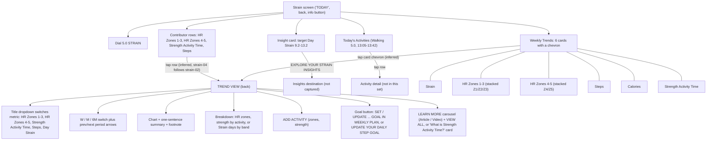

# Strain: WHOOP vs. Pulse UI gaps

## 1. Summary

WHOOP's Strain area is a hub plus five "Trend View" screens (HR Zones 1-3, HR Zones 4-5, Strength Activity Time, Steps, Day Strain). Each contributor row on the Strain screen and each Weekly Trends card opens the matching Trend View. Pulse has the Strain hub itself (dial, contributor rows, insight card, activities) and a Steps detail screen, but it has no Trend Views for zones, strength or Day Strain, and no Weekly Trends cards for zones, steps or strength. The biggest structural gap is the missing Trend View family; the second is the missing stacked zone bars, range breakdowns and narrative sentences that make those screens useful. The Strain hub itself already matches closely.

Gaps by severity: **missing-screen 5, missing-element 13, behaviour 6, visual 3** (27 total). Items marked "intentional" are listed separately in section 4 and are not counted.

WHOOP evidence is the `strain-*.png` set in `docs/research/whoop-walkthrough/`. Pulse evidence is the demo-mode tiles plus code. Where a WHOOP behaviour is not visible in a screenshot (for example the tap target of a row), it is marked "(inferred)".

## 2. WHOOP navigation (as seen in the screenshots)

## 3. Gaps

| # | Gap | Severity | WHOOP ref | Pulse ref | Notes |
|---|---|---|---|---|---|
| 1 | No Trend View for **Heart Rate Zones 1-3**. Header "TREND VIEW", metric title, W/M/6M, stacked chart, breakdown. | missing-screen | strain-04, 05, 06, 07 | none | Pulse's zone rows have no link (`src/server/queries/strain.ts:73`). |
| 2 | No Trend View for **Heart Rate Zones 4-5** (same layout, Z4 light orange and Z5 red-orange). | missing-screen | strain-08, 09, 10, 11, 12, 13 | none | `strain.ts:74`, no `href`. |
| 3 | No Trend View for **Strength Activity Time** (single blue bar per week or day). | missing-screen | strain-14, 15, 16, 17, 18, 19, 20 | none | `strain.ts:75`. The Strain page only has "Workout duration" (all workouts, not strength only): `src/app/(app)/strain/page.tsx:115`. |
| 4 | No Trend View for **Day Strain** (0-21 axis, bars with value labels, band breakdown). | missing-screen | strain-28, 29, 30 | `src/app/(app)/strain/page.tsx:99` (inline "Strain trend" card only) | Pulse's trend is a card on the page, not a screen reached from the dial or a Weekly Trends card. |
| 5 | **Steps** Trend View exists as `/metric/steps`, but it is a different screen (hero + "Steps by hour" + History + stats). WHOOP's is a pure Trend View with a title dropdown, narrative sentence and goal button. | missing-screen | strain-22, 23, 24 | `src/app/(app)/metric/[key]/page.tsx:75` | Counted once; the shared Trend View shell (gaps 6 to 14) would fix this too. |
| 6 | **Metric switcher** at the top of every Trend View: a full-width pill with icon, metric name in caps and a chevron. It switches between HR Zones 1-3, HR Zones 4-5, Strength Activity Time, Steps and Day Strain without going back. | missing-element | strain-04, 14, 22, 28 | none | Pulse has no equivalent; each metric is a separate route. |
| 7 | **Period paging.** A "‹ MAR 19 - APR 15, 26 ›" label with prev/next arrows moves the window back in time (next is disabled at the current period). | behaviour | strain-04, 06, 16, 18, 24 | `src/components/charts/TrendChart.tsx:121` (range toggle only, no paging) | Pulse's ranges always end today. The date switcher on `/metric/[key]` moves the day, not the chart window. |
| 8 | **Weekly-total aggregation.** For zones and strength, M and 6M bars are weekly totals ("Mar 26 - Apr 1") and the headline is "AVG. WEEKLY TOTAL 2:22 hr"; W shows "WEEKLY TOTAL 2:09 hr". Steps and Day Strain stay daily. | behaviour | strain-04, 06, 08, 14, 13 | `TrendChart.tsx:155` (M is daily bars, 6M is a line) | Needs per-week bucketing in the query for zone and strength series. |
| 9 | **Narrative sentence** under the controls, e.g. "You spent 2:09 in zones 1-3 in the last 7 days. This is below your weekly average from the last four weeks (2:22)." Variants exist for W ("During this 7-day period... below your previous 7-day total of 5:27"), Steps ("Your average steps are up from last month. Focus on small improvements...") and Day Strain ("Since Monday, you've averaged a higher Day Strain (14.3)... tracking towards a week of strenuous Strain"). | missing-element | strain-04, 06, 22, 23, 24, 28 | none | Pulse's chart shows only the delta chip (`TrendChart.tsx:62` `RANGE_PRIOR`). Pulse has no copy that compares last 7 days to the 4-week average. |
| 10 | **Stacked zone bars with zone legend.** HR Zones 1-3: Zone 1 pale grey-blue, Zone 2 blue, Zone 3 green, thin dark gap between segments, legend row "ZONE 1 / ZONE 2 / ZONE 3". HR Zones 4-5: Zone 4 light orange, Zone 5 red-orange. In W each bar carries a bold h:mm total above it ("0:40"), and zero days print "0:00". | missing-element | strain-06, 10, 35, 38 | `TrendChart.tsx:348-367` (stack is only wired for Calories and Distance) | The stack mechanism exists; zone series, zone colours and the legend are not hooked up. Pulse's zone colours are in `ZoneBars` only. |
| 11 | **Range breakdown block.** "HR ZONES BREAKDOWN (AVG. WEEKLY TOTAL)" (W says "(WEEKLY TOTAL)"): one proportional segmented bar, then a list "1:57 Zone 1", "0:46 Zone 2"... with colour squares. | missing-element | strain-04, 07, 10, 12 | none | Pulse's `ZoneBars` shows one day (`strain/page.tsx:85`), not a range. |
| 12 | **Strength breakdown by activity type**: "STRENGTH ACTIVITY BREAKDOWN (AVG. WEEKLY TOTAL)", a full-width blue bar and "3:55:34 Weightlifting" (h:mm:ss). | missing-element | strain-18, 19, 20 | none | Pulse knows each exercise's type (`strain.ts:34` `isStrength`), but there is no per-type split. |
| 13 | **Day Strain breakdown by day count**: "STRAIN BREAKDOWN (DAYS)" with a four-segment bar and "0x All Out (>18.0)", "1x Strenuous (14.1-18.0)", "3x Moderate (10.1-14.0)", "3x Light (<10.0)". | missing-element | strain-29, 30 | none | Pulse documents the bands in the info sheet only (`src/app/(app)/_lib/info.tsx:45`). WHOOP's band cut-offs differ from Pulse's (Light 0-9.9, Moderate 10-13.9, Strenuous 14-17.9): confirm which Pulse should show. |
| 14 | **Footnote line** with an "i" icon under the chart: "Zone time is derived from logged activities", "Strength activity time is derived from logged strength activities listed below", "Average does not include today (Apr. 15)", "The Steps algorithm was updated for 5.0 devices...". | missing-element | strain-04, 14, 22, 28 | none | Pulse's text under charts is only "Shaded: your Strain Target" (pulse tile strain-04). The Day Strain "does not include today" rule changes what the average means. |
| 15 | **6M chart style.** Steps 6M: faint daily line, plus one horizontal segment per month with the monthly average above it and a coloured % change below (white for the first month, orange for a drop, green for a rise, e.g. "5,082 -12%", "8,409 +178%"). Zones 6M: dimmed weekly bars with the same monthly segments. | visual | strain-13, 24 | `TrendChart.tsx:155` (6M is a single line) | Pulse already has 1Y as an extra range (`src/lib/url.ts:51`); WHOOP shows only W/M/6M. |
| 16 | **M-range steps chart.** Daily bars, no value labels, x-axis ticks "Mar 18, 25, Apr 1, 8, 15" (stacked day-of-month under the month), "AVG." pill on the left axis edge. Pulse's M chart is close, but the Avg pill sits on the right and the "7,000" reference is extra. | visual | strain-22 | `TrendChart.tsx:171`, `TrendChart.tsx:312` | Minor. Pulse's right-hand pill versus WHOOP's left-hand "AVG." pill. |
| 17 | **Empty chart still draws axes.** With no strength activity in a window WHOOP shows the gridlines, h:mm axis and the "AVG." line at 0:00 and keeps a summary sentence. Pulse replaces the chart with "No data in this range yet." | behaviour | strain-16 | `TrendChart.tsx:407` | A zero total is real data for activity-time metrics, not "missing". |
| 18 | **Add Activity button** (plus icon, caps label, chevron) on the zones and strength Trend Views. | missing-element | strain-07, 12, 16, 19 | none (only on Home: `src/app/(app)/(home)/page.tsx:213`) | On Home, Pulse's button explains that workouts are imported. Reuse that behaviour on the Strain screens. |
| 19 | **Goal buttons:** "SET A HR ZONES GOAL IN WEEKLY PLAN" / "UPDATE YOUR HR ZONES 4-5 GOAL", "SET A GOAL IN WEEKLY PLAN" (strength), "UPDATE YOUR DAILY STEP GOAL" (steps). | missing-element | strain-07, 12, 19, 20, 22, 23, 24 | none | Intentional gap for now: Pulse has no goals or weekly plan (see section 4). Listed so the owner can decide. |
| 20 | **Learn More carousel** on zone screens: header "LEARN MORE", "VIEW ALL →", horizontally scrolling cards tagged ARTICLE ("HR Zones: Calculated for Precision & Accuracy", 5 min. read) or VIDEO ("What is Zone 1?"). | missing-element | strain-07 | none | Needs content (articles/videos). Pulse's closest thing is the "About X" card (`metric/[key]/page.tsx:100`). Likely out of scope for a self-hosted app; flag for a decision. |
| 21 | **"What is Strength Activity Time?" explainer card** (title plus a paragraph on resistance training) under the buttons on the Strength Trend View. | missing-element | strain-19, 20 | `metric/[key]/page.tsx:100` ("About ..." card exists for metrics, but not for zones or strength) | Add per-metric explainer copy when the Trend Views exist. |
| 22 | **Weekly Trends section is missing four of six cards.** WHOOP stacks six cards in this order: Strain, HR Zones 1-3, HR Zones 4-5, Steps, Calories, Strength Activity Time. Pulse has "Strain trend", "Calories burned" and "Workout duration" only. | missing-element | strain-25, 26, 27, 31, 35, 36, 37, 38 | `strain/page.tsx:99-117` | Missing: HR Zones 1-3, HR Zones 4-5, Steps, Strength Activity Time. "Workout duration" has no WHOOP counterpart. |
| 23 | **Weekly Trends heading and fixed range.** WHOOP always shows the heading "Weekly Trends" with the week ending on the selected day. In Pulse the heading only appears when the range is W (`?r=w`) and otherwise reads "Strain trend". | behaviour | strain-25, 27 | `strain/page.tsx:99`; `src/app/(app)/_lib/day.ts:20-21` | WHOOP's cards have no range toggle at all. |
| 24 | **Weekly Trends card as a tap target.** Each card has a title in caps and a right chevron; tapping it opens the Trend View (inferred; the Trend View screenshots follow). Pulse's cards have an info icon and no link. | behaviour | strain-25, 35, 36 | `strain/page.tsx:99-117` (`SectionShell` with an `info` icon, not a link) | Depends on gaps 1-5. |
| 25 | **Selected-day highlight.** WHOOP gives the current day's column in every Weekly Trends card a translucent lighter band, with a white bold two-line label ("Wed / 15"). Pulse already bolds the selected day's letter and fades its bar when it is a running total (calories tile), but draws no band, and its labels are single letters ("F S S M T W T"). | visual | strain-25, 35, 36 | `TrendChart.tsx:180`, `TrendChart.tsx:346-367` | Narrowed after the charts were recaptured. Pulse W bars already carry value labels above them, as WHOOP does. |
| 26 | **Contributor rows are tappable into Trend Views** (inferred) and carry no chevron. Pulse shows a chevron only on rows that go somewhere (Steps and the five extras) and the three zone/strength rows are inert. | behaviour | strain-01, 02 | `strain.ts:73-79`; `src/components/metrics/KeyStatRow.tsx:128` | Fixed by gaps 1 to 3. Chevron styling is a Pulse choice; WHOOP shows none. |
| 27 | **Insight card CTA and copy.** WHOOP: "Your body is capable of taking on moderate effort today. To maintain consistent exercise while balancing recovery, aim for moderate Day Strain between 9.2 and 13.2 today." with the link "EXPLORE YOUR STRAIN INSIGHTS →" (purple, caps). Pulse: "Your body needs rest today. Keep strain between 4.0 and 6.0." with "PLAN TONIGHT'S SLEEP →". | missing-element | strain-02, 03, 32, 33, 34 | `strain/page.tsx:78` | Copy differs by design (the target comes from Pulse's own model). There is no "Strain insights" destination in Pulse. The card styling already matches (gradient border). |

## 3a. Status, score-screens phase (2026-10-08)

Build steps for the score-screens phase: 1 trend helpers (`src/lib/trend.ts`), 2 Trend View query, 3 Trend View screen `/trend/[key]`, 4 `WeeklyTrends`, 5 Sleep, 6 Recovery, 7 Strain. "Hidden" means the component is built but off in `src/lib/features.ts` until Pulse has a data source. "Out of scope" means the owner excluded it for this phase. Decisions are recorded in `docs/design/spec.md` §11 from R29 onwards.

| # | Plan | Status |
|---|---|---|
| 1 | Step 7: HR Zones 1-3 Trend View | Planned |
| 2 | Step 7: HR Zones 4-5 Trend View | Planned |
| 3 | Step 7: Strength Activity Time Trend View | Planned |
| 4 | Step 7: Day Strain Trend View | Planned |
| 5 | Step 3: Steps opens the shared Trend View; `/metric/steps` stays as the day screen | Planned |
| 6 | Step 3: metric dropdown | Planned |
| 7 | Steps 2-3: period stepper | Planned |
| 8 | Steps 1-2: weekly totals for zones and strength (helper done) | In progress |
| 9 | Steps 1 and 3: verdict sentence (helper done) | In progress |
| 10 | Step 7: stacked zone bars with zone legend | Planned |
| 11 | Steps 3 and 7: zones breakdown | Planned |
| 12 | Step 7: strength breakdown by activity type | Planned |
| 13 | Step 7: Day Strain breakdown with WHOOP bands (Light <10, Moderate 10-14, Strenuous 14-18, All Out >18) | Planned |
| 14 | Step 3: footnote line | Planned |
| 15 | Step 3: 6M month segments | Planned |
| 16 | Step 3: AVG pill on the left; no 7,000 line on the Trend View | Planned |
| 17 | Step 3: empty activity-time windows still draw axes and 0:00 | Planned |
| 18 | Step 7: Add activity button (Home's info card) on the zones and strength Trend Views | Planned |
| 19 | Step 7: goal buttons, behind a flag (Pulse has no goals) | Planned (hidden) |
| 20 | Learn More carousel | Out of scope |
| 21 | Steps 3 and 7: "What is Strength Activity Time?" explainer | Planned |
| 22 | Steps 4 and 7: Weekly Trends with all six cards | Planned |
| 23 | Step 4: fixed "Weekly Trends" heading, no range toggle | Planned |
| 24 | Step 4: cards link to their Trend View | Planned |
| 25 | Step 4: selected-day column highlight with two-line labels | Planned |
| 26 | Step 7: zone and strength rows link to their Trend Views | Planned |
| 27 | Step 7: "Explore your strain insights" link to the Day Strain Trend View | Planned |

## 4. Already matches (do not redo)

- **Dial**: arc fill, centred value over "STRAIN" label, grey Strain Target arc with a white tick, back button and info button (`ScoreDial variant="strain"`, `strain/page.tsx:52`). The extra "SO FAR" tag and date arrows in the header are Pulse additions.
- **Contributor rows**: caps label with icon, large h:mm value, small prior-30-day mean underneath, orange/green arrow or grey dot, and the "Today vs. prior 30 days" legend (`strain/page.tsx:61-77`, `strain.ts:72-75`).
- **Insight card**: rounded card with a purple/teal gradient border and a caps link at the bottom (`strain/page.tsx:78`).
- **Activity rows**: blue pill with icon and strain value, caps name, start and end times at right and a thin blue bar (`src/components/metrics/ActivityCard.tsx`). The section heading differs ("Activities" in a card versus WHOOP's "Today's Activities" outside a card) and is a small visual gap.
- **Delta chip**: green up / orange down chip with "vs. prior week/month/6 months" (`TrendChart.tsx:62`). WHOOP's Day Strain chip is grey and neutral ("0.8 vs. prior week"); Pulse's tones follow `direction`.
- **W/M/6M segmented switch**, h:mm axis labels, weekday value labels above W bars, dashed Avg line on M (`TrendChart.tsx:231`, `:171`, `:362`).
- **Intentional differences (not gaps)**:
  - Steps goal and weekly plan do not exist in Pulse; 7,000 is a reference line, not the user's goal. Intentional per `docs/research/metric-detail-patterns.md` ("Not built, for lack of data or a goal"). Gap 19 is therefore a product decision.
  - Five-zone system on heart-rate reserve with "Zone 1" to "Zone 5" naming, "Heart rate zones 1-3 / 4-5" row labels: intentional per `docs/design/spec.md` GZ1 (same edges as WHOOP).
  - Extra contributor rows (Distance, Floors, Active minutes, Active Zone Minutes, Active calories) and the "Strain Target" row: intentional per spec §11 EX1 (`strain.ts:33`).
  - Pulse extras with no WHOOP counterpart on this screen: "Heart rate" and "Time in zones" cards, "Workout duration" card, 1Y range, Steps-by-hour and weekday sections.
  - Calories bars are stacked resting/active (WHOOP's are single blue totals): intentional per `docs/research/metric-detail-patterns.md` section 3.
