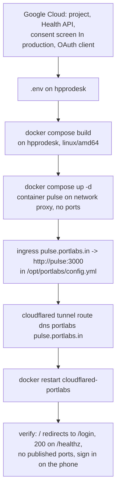
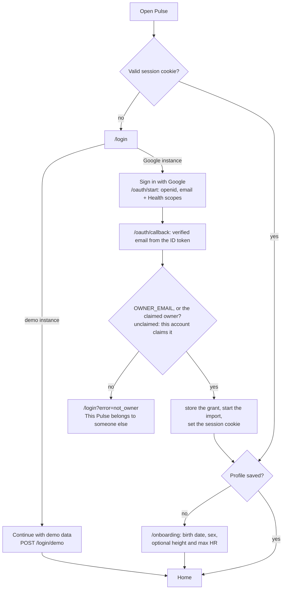

# Pulse runbook

How to set up Google and Cloudflare Tunnel, deploy Pulse to `hpprodesk`, keep it backed up, and fix the usual failures.

Pulse runs as one container named `pulse` on the shared `proxy` docker network, with no published ports. `cloudflared-portlabs` routes `pulse.portlabs.in` to `http://pulse:3000` (see `homelab/cloudflare-tunnel.md`). The app has its own sign-in (plan U20): "Sign in with Google" on a real instance, "Continue with demo data" on a demo one. `src/proxy.ts` sends every request without a valid session to `/login`.

## Flows

Deploy:



Sign-in and first run:



The proxy leaves open only Google's redirect (`/oauth/*`), `/healthz`, build assets and files under `public/`. Server actions check the session again themselves.

## 1. Google Cloud setup

Only needed for real data (`GOOGLE_OAUTH_ENABLED=true`). Demo mode needs none of it. Adapted from Hælan's README, "The one manual step".

1. In <https://console.cloud.google.com>, create a project (for example `pulse`).
2. Under **APIs & Services > Library**, enable the **Google Health API**.
3. Under **Google Auth Platform > Branding / Audience** (the OAuth consent screen), choose **External**. Fill in the app name and your email, and add yourself as a test user.
4. Under **Data access > Add or remove scopes > Manually add scopes**, add `openid` and `.../auth/userinfo.email` (sign-in), then paste the 12 scopes from `SCOPES` in `src/server/sources/google/oauth.ts`, each prefixed with `https://www.googleapis.com/auth/googlehealth.`: the 11 `*.readonly` scopes (activity_and_fitness, health_metrics_and_measurements, sleep, ecg, irn, location, logged_symptoms, mindfulness, reproductive_health, profile, settings) and `nutrition.writeonly`. Nutrition has no read-only scope, so the write scope is the only way to read food and hydration logs. Pulse never writes.
5. Under **Branding**, fill in an app home page (`https://pulse.portlabs.in`) and a privacy policy URL; **Publish app** stays disabled without them. Then, under **Audience**, set the publishing status to **In production**. In **Testing**, refresh tokens expire after 7 days and you would have to reconnect every week. You do not need verification for your own account. The consent screen then shows "Google hasn't verified this app". This is expected: click **Advanced > Go to pulse (unsafe)**.
6. Under **Clients**, create an OAuth client of type **Web application** with these authorized redirect URIs:
   - `http://localhost:3000/oauth/callback`
   - `https://pulse.portlabs.in/oauth/callback`

   Copy the client ID and secret into `.env`. Leave **Authorized JavaScript origins** empty.

   Google refuses raw IP addresses (`http://192.168.1.71:3000/...` fails with "must end with a public top-level domain") and plain `http` for anything but localhost. To sign in from a phone, reach Pulse on an https hostname: the tunnel's `pulse.portlabs.in`, or a Tailscale Serve name (`https://<machine>.<tailnet>.ts.net`). Add that hostname's `/oauth/callback` here. Without `APP_URL`, Pulse builds the redirect from the host the request came in on, so one client serves localhost and the tunnel alike.

## 2. Environment

[`.env.example`](../.env.example) lists and explains every variable. Copy it to `.env` and keep the file at `chmod 600`. The app validates its config at boot and exits if the config is invalid.

| Variable | Local dev | Production (hpprodesk) |
|---|---|---|
| `GOOGLE_OAUTH_ENABLED` | `false` (demo) or `true` | `false` for demo, `true` for real data |
| `TZ` | required | required |
| `GOOGLE_CLIENT_ID`, `GOOGLE_CLIENT_SECRET` | if OAuth on | if OAuth on |
| `OWNER_EMAIL` | unset (first sign-in claims) | **your Google email** |
| `APP_URL` | unset | `https://pulse.portlabs.in` |

- Set `OWNER_EMAIL` on any instance reachable from the internet. Without it, the first Google account to finish sign-in claims the instance, which is only safe if you sign in before anyone else can reach it.
- The profile (birth date, sex, height, max HR) is no longer in `.env`. Onboarding asks for it on first sign-in, and Settings › Profile edits it.
- The session secret is generated on first boot and kept in the database (`instance` table). Deleting that row signs everyone out.
- The image sets `NODE_ENV=production`, `PORT=3000` and `HOSTNAME=0.0.0.0`. Do not set `NODE_ENV` or `HOSTNAME` in `.env`. If you change `PORT`, change the tunnel ingress too.
- The database path defaults to `data/demo.db` or `data/pulse.db` under `/app`, which is the `pulse-data` volume.

## 3. Cloudflare Tunnel

No Cloudflare Access: Pulse signs you in itself. Set `OWNER_EMAIL` before the hostname goes live.

1. In Google Cloud, make sure `https://pulse.portlabs.in/oauth/callback` is an authorized redirect URI (section 1).
2. **Add the ingress rule.** Edit `/opt/portlabs/config.yml` (it is root-owned, so use `sudo`) and add this rule above the `http_status:404` catch-all:

   ```yaml
     - hostname: pulse.portlabs.in
       service: http://pulse:3000
   ```

3. **Route DNS:**

   ```bash
   sudo cloudflared tunnel route dns portlabs pulse.portlabs.in
   ```

4. **Restart the tunnel:**

   ```bash
   sudo docker restart cloudflared-portlabs
   sudo docker logs --tail 20 cloudflared-portlabs   # "Registered tunnel connection"
   ```

Then record the new route in `homelab/cloudflare-tunnel.md`: the architecture diagram and the `config.yml` block.

## 4. Deploy

Build on the server, so that the image includes the linux-x64 better-sqlite3 binary. The standalone output only keeps the binary for the platform that built it.

```bash
# on hpprodesk, in the repo checkout (e.g. /opt/pulse)
git pull
docker compose build
docker compose up -d
docker compose logs -f pulse      # "[worker] started (source: seed|google)"
```

To build on the Mac instead, use `docker buildx build --platform linux/amd64 -t pulse:latest --output type=docker,dest=pulse.tar .`. Copy `pulse.tar` to the server, run `docker load -i pulse.tar` there, then run `docker compose up -d --no-build`.

Verify:

```bash
# Without a session: must be 307 to /login
docker run --rm --network proxy curlimages/curl -s -o /dev/null -w '%{http_code} %{redirect_url}\n' http://pulse:3000/
# Health check: must be 200 and {"ok":true}
docker run --rm --network proxy curlimages/curl -s -w ' %{http_code}\n' http://pulse:3000/healthz
# No published ports: the PORTS column for pulse must be empty (or show only 3000/tcp, without 0.0.0.0)
docker ps --filter name=pulse --format '{{.Names}}\t{{.Ports}}\t{{.Status}}'
```

Also check these:

- Public access is gated. `curl -sI https://pulse.portlabs.in/` should redirect (307) to `/login`.
- On the phone over mobile data, sign in with Google once (the session lasts 90 days). After that, the app loads, and **Install app** works.
- The data survives a restart. Run `docker compose restart pulse`; the same data is still there, and the next sync continues from where it stopped.

## 5. Switch from demo to real data

1. Do the Google Cloud setup in section 1.
2. In `.env`, set `GOOGLE_OAUTH_ENABLED=true`, `GOOGLE_CLIENT_ID`, `GOOGLE_CLIENT_SECRET`, `OWNER_EMAIL` and `APP_URL=https://pulse.portlabs.in`.
3. Run `docker compose up -d --force-recreate`. The app now uses `data/pulse.db`. `data/demo.db` stays in the volume, untouched. To go back to demo, set the flag to false again.
4. Open `https://pulse.portlabs.in`, tap **Sign in with Google**, pass the unverified-app warning and grant every scope. The callback signs you in, stores the refresh token, and the worker starts the backfill. Onboarding then asks for your birth date and sex.
5. Watch `docker compose logs -f pulse` until the backfill finishes. Then check that Today shows real data.

## 6. First real probe

The U3 probe fetches 7 days of every data type into `raw_payloads`. It prints field shapes and counts, never values. Run it once, locally, after the first consent, to check `docs/data-notes.md` against real data.

**`tsx` is not yet a devDependency. Add it first:** `pnpm add -D tsx`.

```bash
# .env: GOOGLE_OAUTH_ENABLED=true, client ID/secret
pnpm dev                        # then open http://localhost:3000 and Sign in with Google
# stop the dev server (the probe and the server share the 5 QPS per-user limit), then:
pnpm tsx --env-file=.env src/server/sources/google/probe.ts
```

## 7. Backups

The database is in the `pulse-data` named volume (the host path is `docker volume inspect pulse_pulse-data`). Take online backups with SQLite's backup API, which is safe while the app is writing in WAL mode. Do not copy the `.db` file directly.

```bash
#!/bin/sh
# /opt/pulse/backup.sh, run daily from root's crontab. Keeps 14 days.
set -eu
umask 077
dir=/var/backups/pulse
mkdir -p "$dir" && chmod 700 "$dir"
f="$dir/pulse-$(date +%F).db"
# better-sqlite3 is not hoisted in the standalone node_modules, hence the glob.
docker exec pulse node -e "const D=require(require('fs').globSync('/app/node_modules/.pnpm/better-sqlite3@*/node_modules/better-sqlite3')[0]);new D('/app/data/pulse.db',{readonly:true}).backup('/tmp/backup.db').then(()=>process.exit(0),e=>{console.error(e);process.exit(1)})"
docker cp pulse:/tmp/backup.db "$f" && docker exec pulse rm -f /tmp/backup.db
chmod 600 "$f"
ls -1t "$dir"/pulse-*.db | tail -n +15 | xargs -r rm -f
```

If `sqlite3` is installed on the host, this does the same: `sudo sqlite3 "$(docker volume inspect -f '{{.Mountpoint}}' pulse_pulse-data)/pulse.db" ".backup '$f'"`.

- Backups stay on the box, in a `0700` directory, as `0600` files, with a fixed 14-day retention.
- **Encrypt anything before it leaves the box.** Use for example `age -r <your-age-pubkey> -o pulse-$(date +%F).db.age "$f"` (or `gpg --symmetric`). Copy only the `.age` file offsite. Never copy the plain `.db`.
- To restore, run `docker compose stop pulse`. Copy the backup over `pulse.db` in the volume, and delete the `pulse.db-wal` and `pulse.db-shm` files next to it. Then run `docker compose start pulse`.

## 8. Security posture

`hpprodesk` is shared, and a second admin has root. Root can read the volume, `.env` (with the Google client secret), the stored refresh token and all health data. This is accepted for personal use. Do not store anything here that you would not show that admin. These measures limit the exposure:

- One owner per instance. Only `OWNER_EMAIL` (or the account that claimed the instance) gets a session; any other Google account is refused before its tokens are stored.
- The session is an HS256 JWT in an httpOnly, SameSite=Lax cookie (Secure over https), signed with a per-instance secret. The proxy checks it on every page, and every server action checks it again. `/healthz` returns `{"ok":true}` and no data.
- The container publishes no ports. It can only be reached through `proxy` and the tunnel.
- OAuth uses a single-use `state`. The Health scopes are read-only. Logs contain no secrets and no response bodies.
- `.gitignore` and `.dockerignore` keep `data/`, `.env*` and the databases out of git and out of the image.
- Backups go into a `0700` directory as `0600` files, and they are encrypted before they go offsite.
- If you suspect a leak, revoke the app at <https://myaccount.google.com/permissions>, rotate the client secret, then reconnect.

## 9. Troubleshooting

**"This Pulse belongs to someone else".** The Google account isn't the owner. Check `OWNER_EMAIL`, or, if unset, which account claimed the instance: `select owner_email from instance` in the database. To hand the instance over, set `OWNER_EMAIL` and restart.

**Back on the sign-in page after Google, with an error.** `access_denied`: the consent was cancelled. `auth_revoked`: Google returned no refresh token; revoke Pulse at <https://myaccount.google.com/permissions> and sign in again. `redirect_uri_mismatch` (on Google's page): the host you opened Pulse on has no `/oauth/callback` entry in the OAuth client.

**The container restarts in a loop.** Run `docker compose logs pulse`. `Invalid configuration:` lists the bad variables.

**502 from Cloudflare.** The container is down or not on `proxy`. See the 502 runbook in `homelab/cloudflare-tunnel.md`.

**Reconnect Google.** The app shows a reconnect banner when the refresh token is revoked or expired (`auth_revoked`). Use **Reconnect Google** in Settings and consent again. If Google returns no refresh token, revoke Pulse at <https://myaccount.google.com/permissions> and try again. If tokens die every 7 days, the consent screen went back to **Testing**: set it to **In production**.
