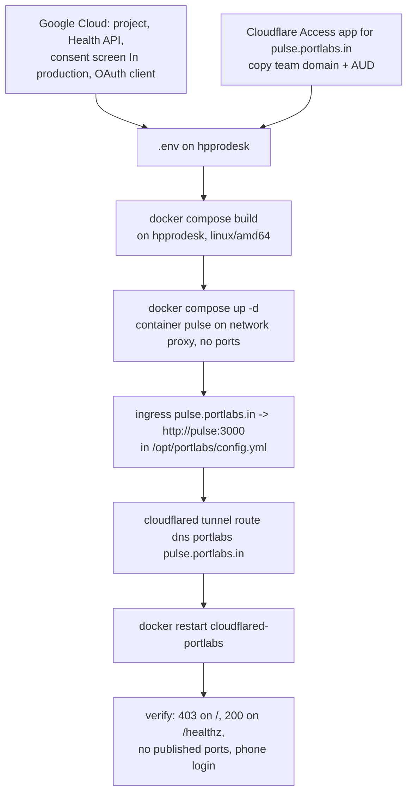
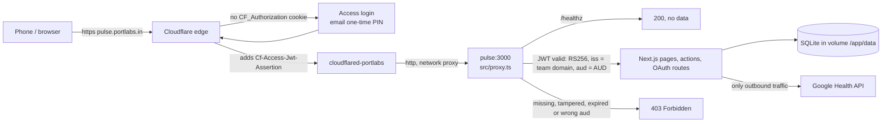

# Pulse runbook

How to set up Google and Cloudflare, deploy Pulse to `hpprodesk` behind Cloudflare Access, keep it backed up, and fix the usual failures.

Pulse runs as one container named `pulse` on the shared `proxy` docker network, with no published ports. `cloudflared-portlabs` routes `pulse.portlabs.in` to `http://pulse:3000` (see `homelab/cloudflare-tunnel.md`). Cloudflare Access sits in front, and the app verifies the Access JWT again on every request (`src/proxy.ts`, `src/server/access.ts`). If Access is not configured, the app does not start.

## Flows

Deploy:



Request:



Every path needs the JWT except `/healthz`. That includes `/_next/static/*`, `/manifest.webmanifest` and the icons. Cloudflare adds the header to every request it forwards, and the manifest is fetched with credentials.

## 1. Google Cloud setup

Only needed for real data (`GOOGLE_OAUTH_ENABLED=true`). Demo mode needs none of it. Adapted from Hælan's README, "The one manual step".

1. In <https://console.cloud.google.com>, create a project (for example `pulse`).
2. Under **APIs & Services > Library**, enable the **Google Health API**.
3. Under **Google Auth Platform > Branding / Audience** (the OAuth consent screen), choose **External**. Fill in the app name and your email, and add yourself as a test user.
4. Under **Data access**, add exactly the three read-only scopes from `SCOPES` in `src/server/sources/google/oauth.ts`:
   - `https://www.googleapis.com/auth/googlehealth.health_metrics_and_measurements.readonly`
   - `https://www.googleapis.com/auth/googlehealth.sleep.readonly`
   - `https://www.googleapis.com/auth/googlehealth.activity_and_fitness.readonly`
5. Under **Audience**, set the publishing status to **In production**. In **Testing**, refresh tokens expire after 7 days and you would have to reconnect every week. You do not need verification for your own account. The consent screen then shows "Google hasn't verified this app". This is expected: click **Advanced > Go to pulse (unsafe)**.
6. Under **Clients**, create an OAuth client of type **Web application** with these authorized redirect URIs:
   - `http://localhost:3000/oauth/callback`
   - `https://pulse.portlabs.in/oauth/callback`

   Copy the client ID and secret into `.env`.

## 2. Environment

[`.env.example`](../.env.example) lists and explains every variable. Copy it to `.env` and keep the file at `chmod 600`. The app validates its config at boot and exits if the config is invalid.

| Variable | Local dev | Production (hpprodesk) |
|---|---|---|
| `GOOGLE_OAUTH_ENABLED` | `false` (demo) or `true` | `false` for demo, `true` for real data |
| `BIRTH_DATE`, `SEX`, `TZ` | required | required |
| `GOOGLE_CLIENT_ID`, `GOOGLE_CLIENT_SECRET` | if OAuth on | if OAuth on |
| `APP_URL` | `http://localhost:3000` | `https://pulse.portlabs.in` |
| `CF_ACCESS_TEAM_DOMAIN` | unset | `https://<team>.cloudflareaccess.com` |
| `CF_ACCESS_AUD` | unset | the Access application's AUD tag |
| `DEV_ACCESS_BYPASS` | `1` | **remove the line or set it to `0`** |

- The image sets `NODE_ENV=production`, `PORT=3000` and `HOSTNAME=0.0.0.0`. Do not set `NODE_ENV` or `HOSTNAME` in `.env`. If you change `PORT`, change the tunnel ingress too.
- `DEV_ACCESS_BYPASS=1` comes from `.env.example`. Under `NODE_ENV=production` it makes the container exit at boot. This is intended: the bypass can never reach production.
- The database path defaults to `data/demo.db` or `data/pulse.db` under `/app`, which is the `pulse-data` volume.

## 3. Cloudflare

Do these steps in this order. The Access app must exist before the hostname goes live, so the app is never public, even for a moment.

1. **Create the Access application.** In Cloudflare Zero Trust, go to **Access > Applications > Add an application > Self-hosted**.
   - Domain: `pulse.portlabs.in`.
   - Session duration: about 30 days (`720h` or `1 month`), so that the installed PWA rarely has to log in again.
   - Policy: **Allow**, with the include rule **Emails** set to your email. Add no other rules.
   - Login method: one-time PIN (or your usual IdP).
   - After saving, copy the **Application Audience (AUD) tag** into `CF_ACCESS_AUD`. Copy your team domain (**Settings > Custom Pages**, or the `<team>.cloudflareaccess.com` URL) into `CF_ACCESS_TEAM_DOMAIN`, as `https://<team>.cloudflareaccess.com` with no trailing path.
2. **Add the ingress rule.** Edit `/opt/portlabs/config.yml` (it is root-owned, so use `sudo`) and add this rule above the `http_status:404` catch-all:

   ```yaml
     - hostname: pulse.portlabs.in
       service: http://pulse:3000
   ```

3. **Route DNS:**

   ```bash
   sudo cloudflared tunnel route dns portlabs pulse.portlabs.in
   ```

4. **Restart the tunnel:**

   ```bash
   sudo docker restart cloudflared-portlabs
   sudo docker logs --tail 20 cloudflared-portlabs   # "Registered tunnel connection"
   ```

Then record the new route in `homelab/cloudflare-tunnel.md`: the architecture diagram and the `config.yml` block.

## 4. Deploy

Build on the server, so that the image includes the linux-x64 better-sqlite3 binary. The standalone output only keeps the binary for the platform that built it.

```bash
# on hpprodesk, in the repo checkout (e.g. /opt/pulse)
git pull
docker compose build
docker compose up -d
docker compose logs -f pulse      # "[worker] started (source: seed|google)"
```

To build on the Mac instead, use `docker buildx build --platform linux/amd64 -t pulse:latest --output type=docker,dest=pulse.tar .`. Copy `pulse.tar` to the server, run `docker load -i pulse.tar` there, then run `docker compose up -d --no-build`.

Verify:

```bash
# Origin without a JWT: must be 403 (fail closed even if Access is misconfigured)
docker run --rm --network proxy curlimages/curl -s -o /dev/null -w '%{http_code}\n' http://pulse:3000/
# Health check: must be 200 and {"ok":true}
docker run --rm --network proxy curlimages/curl -s -w ' %{http_code}\n' http://pulse:3000/healthz
# No published ports: the PORTS column for pulse must be empty (or show only 3000/tcp, without 0.0.0.0)
docker ps --filter name=pulse --format '{{.Names}}\t{{.Ports}}\t{{.Status}}'
```

Also check these:

- Public access is gated. `curl -sI https://pulse.portlabs.in/` should redirect (302) to `<team>.cloudflareaccess.com`.
- On the phone over mobile data, Access asks you to log in once. After that, the app loads, and **Install app** works.
- The data survives a restart. Run `docker compose restart pulse`; the same data is still there, and the next sync continues from where it stopped.

## 5. Switch from demo to real data

1. Do the Google Cloud setup in section 1.
2. In `.env`, set `GOOGLE_OAUTH_ENABLED=true`, `GOOGLE_CLIENT_ID`, `GOOGLE_CLIENT_SECRET` and `APP_URL=https://pulse.portlabs.in`.
3. Run `docker compose up -d --force-recreate`. The app now uses `data/pulse.db`. `data/demo.db` stays in the volume, untouched. To go back to demo, set the flag to false again.
4. Open `https://pulse.portlabs.in/oauth/start`, pass the unverified-app warning and grant all three scopes. The callback stores the refresh token, and the worker starts the backfill.
5. Watch `docker compose logs -f pulse` until the backfill finishes. Then check that Today shows real data.

## 6. First real probe

The U3 probe fetches 7 days of every data type into `raw_payloads`. It prints field shapes and counts, never values. Run it once, locally, after the first consent, to check `docs/data-notes.md` against real data.

**`tsx` is not yet a devDependency. Add it first:** `pnpm add -D tsx`.

```bash
# .env: GOOGLE_OAUTH_ENABLED=true, client ID/secret, APP_URL=http://localhost:3000
pnpm dev                        # then open http://localhost:3000/oauth/start and consent
# stop the dev server (the probe and the server share the 5 QPS per-user limit), then:
pnpm tsx --env-file=.env src/server/sources/google/probe.ts
```

## 7. Backups

The database is in the `pulse-data` named volume (the host path is `docker volume inspect pulse_pulse-data`). Take online backups with SQLite's backup API, which is safe while the app is writing in WAL mode. Do not copy the `.db` file directly.

```bash
#!/bin/sh
# /opt/pulse/backup.sh, run daily from root's crontab. Keeps 14 days.
set -eu
umask 077
dir=/var/backups/pulse
mkdir -p "$dir" && chmod 700 "$dir"
f="$dir/pulse-$(date +%F).db"
# better-sqlite3 is not hoisted in the standalone node_modules, hence the glob.
docker exec pulse node -e "const D=require(require('fs').globSync('/app/node_modules/.pnpm/better-sqlite3@*/node_modules/better-sqlite3')[0]);new D('/app/data/pulse.db',{readonly:true}).backup('/tmp/backup.db').then(()=>process.exit(0),e=>{console.error(e);process.exit(1)})"
docker cp pulse:/tmp/backup.db "$f" && docker exec pulse rm -f /tmp/backup.db
chmod 600 "$f"
ls -1t "$dir"/pulse-*.db | tail -n +15 | xargs -r rm -f
```

If `sqlite3` is installed on the host, this does the same: `sudo sqlite3 "$(docker volume inspect -f '{{.Mountpoint}}' pulse_pulse-data)/pulse.db" ".backup '$f'"`.

- Backups stay on the box, in a `0700` directory, as `0600` files, with a fixed 14-day retention.
- **Encrypt anything before it leaves the box.** Use for example `age -r <your-age-pubkey> -o pulse-$(date +%F).db.age "$f"` (or `gpg --symmetric`). Copy only the `.age` file offsite. Never copy the plain `.db`.
- To restore, run `docker compose stop pulse`. Copy the backup over `pulse.db` in the volume, and delete the `pulse.db-wal` and `pulse.db-shm` files next to it. Then run `docker compose start pulse`.

## 8. Security posture

`hpprodesk` is shared, and a second admin has root. Root can read the volume, `.env` (with the Google client secret), the stored refresh token and all health data. This is accepted for personal use. Do not store anything here that you would not show that admin. These measures limit the exposure:

- Access is checked twice. Cloudflare Access is checked at the edge. The app checks it again, fail-closed (RS256 signature, issuer and AUD), on every path except `/healthz`. `/healthz` returns `{"ok":true}` and no data.
- The container publishes no ports. It can only be reached through `proxy` and the tunnel. The bypass is refused outside `next dev`.
- OAuth uses a single-use `state`. The scopes are read-only. Logs contain no secrets and no response bodies.
- `.gitignore` and `.dockerignore` keep `data/`, `.env*` and the databases out of git and out of the image.
- Backups go into a `0700` directory as `0600` files, and they are encrypted before they go offsite.
- If you suspect a leak, revoke the app at <https://myaccount.google.com/permissions>, rotate the client secret, then reconnect.

## 9. Troubleshooting

**403 on every page after login.** The app rejected the Access JWT.
- `CF_ACCESS_AUD` must be the AUD tag of *this* Access application. Each application has its own tag. If you recreated the app, the tag changed.
- `CF_ACCESS_TEAM_DOMAIN` must be exactly `https://<team>.cloudflareaccess.com`. It is the issuer, so a wrong team name or `http://` does not match.
- The container must reach `https://<team>.cloudflareaccess.com/cdn-cgi/access/certs` to fetch the keys. Check with `docker exec pulse node -e "fetch(process.env.CF_ACCESS_TEAM_DOMAIN+'/cdn-cgi/access/certs').then(r=>console.log(r.status))"`.
- After you fix `.env`, run `docker compose up -d --force-recreate`.

**The container restarts in a loop.** Run `docker compose logs pulse`. `Invalid configuration:` lists the bad variables. Often the cause is `DEV_ACCESS_BYPASS` left at `1`, or a missing `CF_ACCESS_*`.

**502 from Cloudflare.** The container is down or not on `proxy`. See the 502 runbook in `homelab/cloudflare-tunnel.md`.

**Access login inside the installed PWA.** When the Access session expires, the standalone PWA can show the Access login page, or a request fails with a redirect. The guarded reload from plan U13 is meant to recover from this. If the PWA stays stuck, open `https://pulse.portlabs.in` in the phone's browser, log in, then reopen the PWA (the cookie is shared). The 30-day session keeps this rare. If the manifest or the icons do not load (no install prompt), the session cookie is missing. Log in in the browser first.

**Reconnect Google.** The app shows a reconnect banner when the refresh token is revoked or expired (`auth_revoked`). Open `https://pulse.portlabs.in/oauth/start` and consent again. If Google returns no refresh token, revoke Pulse at <https://myaccount.google.com/permissions> and try again. If tokens die every 7 days, the consent screen went back to **Testing**: set it to **In production**.
