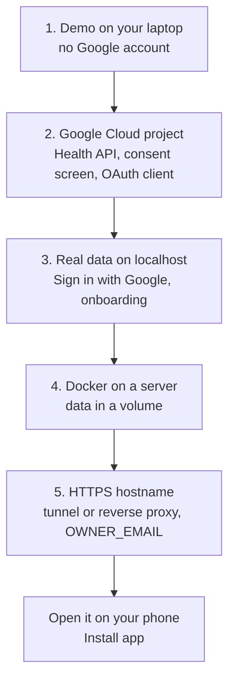

# Setting up Pulse

Pulse runs on your own machine or server: one Next.js app with its sync worker, on SQLite. One instance
serves one person. This guide takes you from a demo on your laptop to your own Fitbit Air data on a server
you can open from your phone. The maintainer's own server deployment is in [runbook.md](runbook.md).



## 1. Try the demo

You need Node 24 and pnpm (`corepack enable` uses the version pinned in `package.json`).

```sh
git clone https://github.com/adityaongit/pulse.git
cd pulse
pnpm install
cp .env.example .env    # GOOGLE_OAUTH_ENABLED=false: demo mode
pnpm dev                # open http://localhost:3000 and "Continue with demo data"
```

Demo mode writes 180 days of deterministic data into `data/demo.db`. Nothing leaves your machine.

## 2. Google Cloud project

Pulse reads your data through the [Google Health API](https://developers.google.com/health). The same OAuth
client signs you in.

1. Create a project at <https://console.cloud.google.com> and enable the **Google Health API**.
2. **Google Auth Platform › Branding / Audience**: user type **External**; add your app name, your email,
   a home page and a privacy policy URL (any page of yours works for personal use).
3. **Data access**: add `openid`, `.../auth/userinfo.email`, `.../auth/userinfo.profile`, and the Google Health
   scopes listed in `SCOPES` in `src/server/sources/google/oauth.ts` (each prefixed with
   `https://www.googleapis.com/auth/googlehealth.`).
4. **Audience**: set the publishing status to **In production**. In Testing, Google expires the grant every
   7 days. You don't need Google's verification for your own account; the consent screen will warn that the
   app is unverified, which is expected (**Advanced › Go to ...**).
5. **Clients › Create client › Web application**. Under **Authorized redirect URIs** add one entry per
   address you will open Pulse on, each ending in `/oauth/callback`:
   - `http://localhost:3000/oauth/callback`
   - `https://pulse.example.com/oauth/callback` (your HTTPS hostname from step 5)

   Google accepts plain `http` only for localhost and never accepts a raw IP address such as
   `192.168.1.10`. To use Pulse from your phone, give it an HTTPS hostname (step 5).
6. Copy the client ID and secret.

Google Health must be set up for the Google account you sign in with: the Fitbit Air must be paired in the
Google Health app with that account (or your Fitbit account moved to it). Otherwise Pulse refuses the
sign-in with "That Google account has no Google Health profile".

## 3. Real data on localhost

In `.env`:

```sh
GOOGLE_OAUTH_ENABLED=true
GOOGLE_CLIENT_ID=...apps.googleusercontent.com
GOOGLE_CLIENT_SECRET=...
OWNER_EMAIL=you@gmail.com     # the Google account your Fitbit Air uses
TZ=Asia/Kolkata               # your IANA time zone
```

Restart `pnpm dev`, open <http://localhost:3000> and **Sign in with Google**. Allow every permission. Onboarding
asks for your birth date and sex (Google doesn't share them); then the import of the last 180 days starts,
and Settings shows its progress. Real data lives in `data/pulse.db`, apart from the demo.

## 4. Run it with Docker

The image builds the app and keeps the database in a volume. A minimal compose file for your own server:

```yaml
services:
  pulse:
    build: .
    restart: unless-stopped
    env_file: .env
    volumes:
      - pulse-data:/app/data
    ports:
      - "127.0.0.1:3000:3000"   # only the reverse proxy or tunnel on this machine can reach it
volumes:
  pulse-data:
```

```sh
docker compose up -d --build
docker compose logs -f pulse    # "[worker] started (source: google)"
```

Build the image on the server itself (or with `--platform` for its architecture): the SQLite driver is a
native module.

## 5. Put it on HTTPS

Pick one:

| Option | Good for | Notes |
|---|---|---|
| [Cloudflare Tunnel](https://developers.cloudflare.com/cloudflare-one/connections/connect-networks/) | Reaching it from anywhere, no open ports | Route `pulse.example.com` to `http://localhost:3000` (or the container). |
| [Tailscale Serve](https://tailscale.com/kb/1312/serve) | Your devices only | `https://<machine>.<tailnet>.ts.net` works as a Google redirect URI. |
| Caddy or nginx with Let's Encrypt | A server with a public IP | Forward `X-Forwarded-Proto` so the session cookie is marked Secure. |

Then:

1. Add `https://<your-host>/oauth/callback` to the OAuth client (step 2.5).
2. Set `OWNER_EMAIL` **before** the hostname is reachable. Without it, the first Google account to sign in
   claims the instance.
3. If the proxy rewrites the host, set `APP_URL=https://<your-host>` so the OAuth redirect uses it.
4. Open the hostname on your phone, sign in, and use the browser's **Install app**.

## Environment reference

Every variable is listed in [`.env.example`](../.env.example); the server validates them at boot and exits
with a list of what's wrong.

| Variable | Required | Meaning |
|---|---|---|
| `GOOGLE_OAUTH_ENABLED` | no (false) | `false`: demo data; `true`: your Google Health data |
| `TZ` | yes | Your IANA time zone; days are cut at your local midnight |
| `GOOGLE_CLIENT_ID`, `GOOGLE_CLIENT_SECRET` | with Google | The OAuth client from step 2 |
| `OWNER_EMAIL` | strongly recommended | The only Google account allowed in |
| `APP_URL` | no | Pins the OAuth redirect host behind a proxy |
| `DATABASE_PATH` | no | Defaults to `data/demo.db` or `data/pulse.db` |
| `AVATAR_URL` | no | A default avatar photo; your Google photo or an upload wins |

## Keeping it running

- **Update:** `git pull && docker compose up -d --build`. Migrations run at boot.
- **Back up** the database with SQLite's online backup, never by copying the file while it runs; the
  [runbook](runbook.md#7-backups) has a script. Encrypt backups before they leave the machine.
- **Sign everyone out:** delete the row in the `instance` table; a new session secret is created on the next request.
- **Disconnect Google:** Settings › Data source › Disconnect removes Pulse's access in your Google account too.

## Troubleshooting

| Symptom | Fix |
|---|---|
| Google says `redirect_uri_mismatch` | The address you opened Pulse on has no matching redirect URI in the OAuth client. |
| "This Pulse belongs to someone else" | You signed in with an account other than `OWNER_EMAIL` or the first one that claimed the instance. |
| "No Google Health profile" | That Google account has no Fitbit data; sign in with the one in your Google Health app. |
| Grant stops working after a week | The consent screen is still in Testing; set it to In production and sign in again. |
| Server exits at boot with `Invalid configuration` | The message lists each bad variable. |

Still stuck? Open an issue with the bug template (and no personal data).
